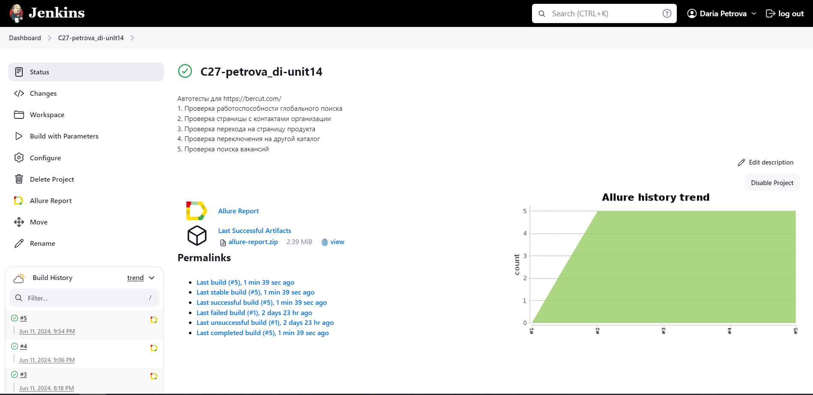
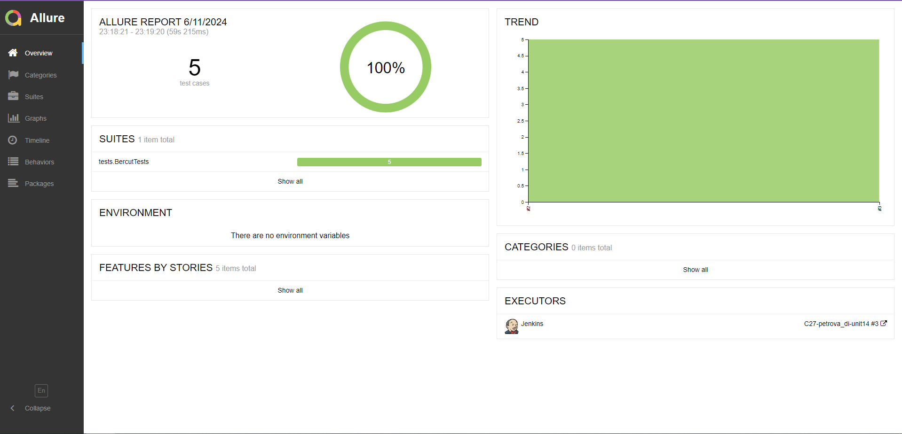
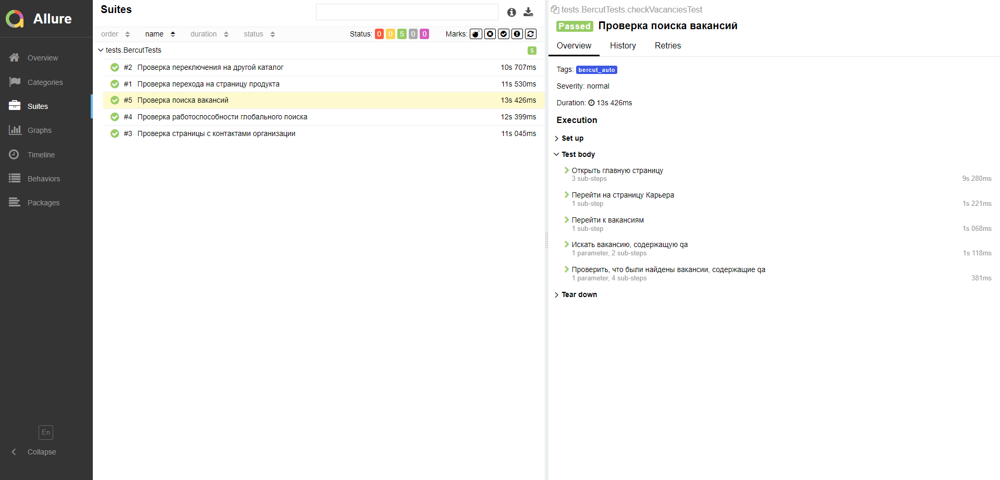
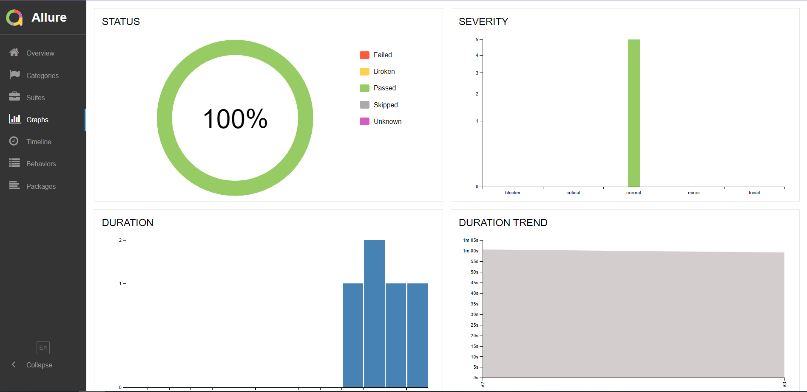
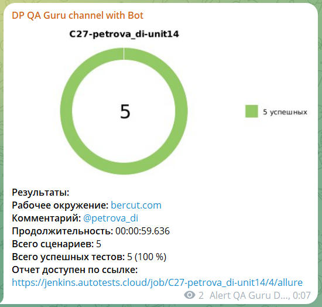
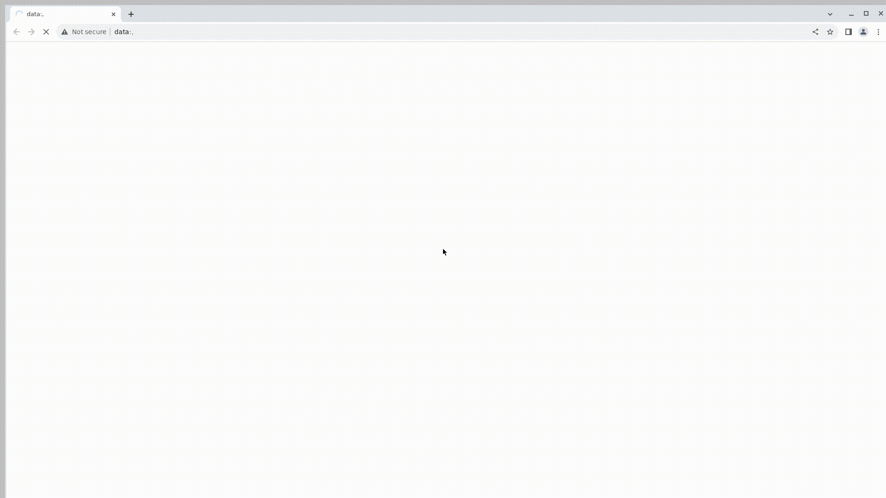

# Проект по автоматизации тестирования для компании [](https://bercut.com/)
>Более 28 лет Bercut выступает технологическим партнером компаний, встающих на путь цифровой трансформации. Команда Bercut — это сотни профессионалов в области высоких технологий, которые опираясь на опыт и экспертизу, поставляют на мировой рынок отраслевые программные решения, ориентированные на бизнес.

## :scroll: Содержание
- [Используемый стек](#computer-используемый-стек)
- [Автоматизированные тесты](#ballot_box_with_check-автоматизированные-тесты)
- [Сборка в Jenkins](#-сборка-в-jenkins)
- [Allure-отчет](#-allure-отчет)
- [Уведомления в Telegram](#-уведомления-в-telegram)
- [Видео примера запуска тестов в Selenoid](#-видео-примера-запуска-тестов-в-selenoid)
  
## :computer: Используемый стек
<p align="center">
<a href="https://www.jetbrains.com/idea/"></a> 
<a href="https://www.java.com/"></a>
<a href="https://selenide.org/"></a> 
<a href="https://aerokube.com/selenoid/"></a>
<a href="https://github.com/allure-framework/allure2"></a>
<a href="https://gradle.org/"></a> 
<a href="https://junit.org/junit5/"></a> 
<a href="https://github.com/"></a> 
<a href="https://www.jenkins.io/"></a> 
<a href="https://telegram.org/"></a>  
</p>

Автотесты:
- Реализованы на языке ```Java```
- В качестве сборщика используется ```Gradle```
- Используются фреймворки ```JUnit 5``` и ```Selenide```
- При запуске тестов браузер запускается в ```Selenoid```
- Для удаленного запуска используется сборка в ```Jenkins```
- Для сборки формируется ```Allure Report```
- Результат отправляется в ```Telegram``` канал при помощи бота 

Allure-отчет:
* Шаги теста
* Скриншот страницы на последнем шаге
* Исходный код страницы
* Логи консоли браузера
* Видео выполнения теста

## :ballot_box_with_check: Автоматизированные тесты

- Проверка глобального поиска по всем ресурсам сайта
- Проверка страницы с контактами организации
- Проверка перехода на страницу продукта
- Проверка переключения каталогов
- Проверка поиска вакансий

##  Сборка в Jenkins
[](https://jenkins.autotests.cloud/job/C27-petrova_di-unit14/)

### *Параметры сборки в Jenkins:*
```TASK``` - название задачи (возможные варианты: ```bercut```)  
```WDHOST``` - адрес удаленного браузера (selenoid) (возможные варианты: ```selenoid.autotests.cloud```)  
```BROWSER``` - браузер для запуска тестов (по умолчанию - ```chrome```)  
```BROWSER_VERSION``` - версия браузера (по умолчанию - ```120```)  
```BROWSE_SIZE``` - размер окна браузера (по умолчанию - ```1920x1080```)  


### *Команды для запуска из терминала*


***Локальный запуск:***
```bash
gradle clean bercut
```
При выполнении данной команды в терминале IDE тесты запустятся удаленно в <code>Selenoid</code>.

***Запуск в Jenkins:***
```java
clean ${TASK}
-DwdHost=${WDHOST}
-Dbrowser=${BROWSER}
-DbrowserVersion=${BROWSER_VERSION}
-DbrowseSize=${BROWSE_SIZE}
```

Для запуска сборки необходимо:
1. Перейти в сборку
2. Нажать ```Собрать с параметрами```/```Build with parameters```
3. Нажать ```Собрать```/```Build```

##  Allure-отчет
После выполнения сборки в блоке ```История сборок```/```Build History``` напротив конкретной сборки отображается значок 
[](https://jenkins.autotests.cloud/job/C27-petrova_di-unit14/allure/),
при нажатии на который открывается страница со сформированным html-отчетом и тестовой документацией.

### *Главная страница отчета* 
[](https://jenkins.autotests.cloud/job/C27-petrova_di-unit14/allure/)

### *Тест-кейсы*
[](https://jenkins.autotests.cloud/job/C27-petrova_di-unit14/allure/#suites/2184bf7abab8d293fe47b00eaed1b94c/f9953d2919a8ac1e/)

### *Графики*
[](https://jenkins.autotests.cloud/job/C27-petrova_di-unit14/allure/#graph)


##  Уведомления в Telegram
После завершения сборки специальный бот, созданный в ```Telegram```, автоматически обрабатывает и отправляет сообщение с отчетом о прогоне тестов.

[]()

###  Видео примера запуска тестов в Selenoid

В Allure-отчетах к каждому тесту прикреплен не только скриншот, но и видео прохождения теста.  
Пример:

[]()
